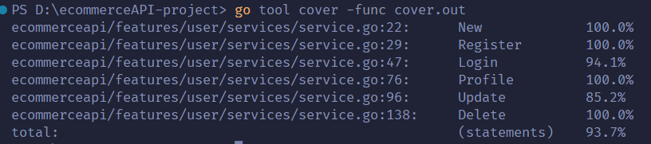
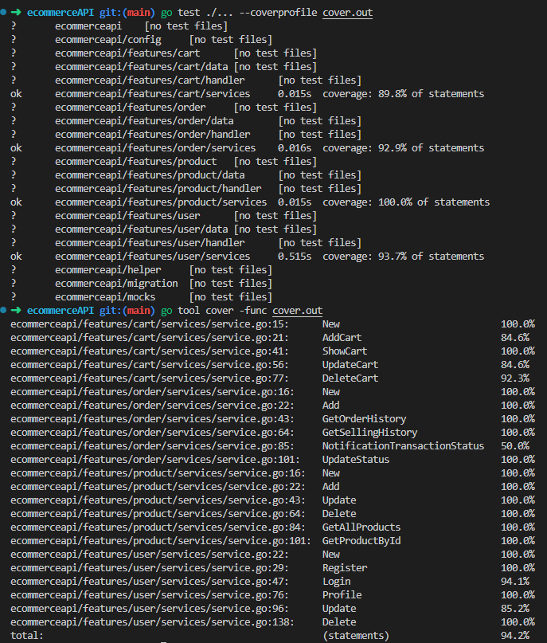

### Build App & Database


# YSHOP APP

This is a golang rest api project group organized by Alterra Academy. This API is used to run YSHOP applications. This application has features as below.


# Features
## User:
- Register
- Login
- Show profile
- Edit profile
- Deactive account

<div>

<details>

| Feature User | Endpoint | Param | JWT Token | Function |
| --- | --- | --- | --- | --- |
| POST | /register | - | NO | This is how users register their account. |
| POST | /login  | - | NO | This is how users log in.  |
| GET | /users | - | YES | Users obtain their account information in this form. |
| PUT | /users | - | YES | This is how users Update their profile. |
| DELETE | /users | - | YES | This is how users Delete their profile. |

</details>

<div>

## Product :
- Add product
- Show all product
- Edit product
- Show detail product
- Delete product

<div>

<details>

| Feature Product | Endpoint | Param | JWT Token | Function |
| --- | --- | --- | --- | --- |
| POST | /products | - | YES | This is how users add product in their account. |
| GET | /products  | - | NO | This is how all products show in homepage.  |
| PUT | /products | ID PRODUCT | YES | Users edit their product information in this form. |
| GET | /products | ID PRODUCT | NO | This is how users show detail product. |
| DELETE | /products | ID PRODUCT | YES | This is how users Delete their product. |

</details>

</div>

## Cart :
- Add product in cart
- Show all product in cart
- Delete all product in cart
- Edit or Update quantity product in cart

<div>

<details>

| Feature Cart | Endpoint | Param | JWT Token | Function |
| --- | --- | --- | --- | --- |
| POST | /carts | - | YES | This is how users add product in their cart. |
| GET | /carts  | - | YES | This is how show all product in cart.  |
| DELETE | /carts | ID CART | YES | This is how users Delete their all products in cart. |
| PUT | /carts | ID CART | YES | Users edit their product quantity in cart. |

</details>

</div>


## Oder :
- Add order to payment gateway
- Show order history
- Show sales history
- Recieve payment notification

<div>

<details>

| Feature Cart | Endpoint | Param | JWT Token | Function |
| --- | --- | --- | --- | --- |
| POST | /orders | - | YES | This is how users add orders to transaction. |
| GET | /orders  | - | YES | This is how users show order history.  |
| DELETE | /sales | - | YES | This is how seller sales history. |
| POST | /paymentnotification | - | - | Handling payment notification from midtrans. |

</details>

</div>


# ERD


# API Documentations

[Click here](https://app.swaggerhub.com/apis-docs/icxz1/E-commerceAPI/1.0.0#/) to see documentations.


## How to Install To Your Local

- Clone it

```
$ git clone https://github.com/ALTA-Project3-Group6/ecommerceAPI-project
```

- Go to directory

```
$ cd ecommerceAPI-project
```

# UNIT TEST COVERAGE BY FEATURE

<div>
- USER
</div>
<div>

</div>

<div>
- PRODUCT
</div>
<div>

</div>

<div>
- CART
</div>
<div>

</div>

<div>
- ORDER
</div>
<div>

</div>

# UNIT TEST COVERAGE ALL


## Authors 👑

-   Muh Fauzan Putra  [](https://github.com/mfauzanptra)

-  Alfian Aditya [](https://github.com/icxz1)

 <p align="right">(<a href="#top">back to top</a>)</p>
<h3>
<p align="center">:copyright: January 2023 </p>
</h3>
<!-- end -->
<!-- comment -->
